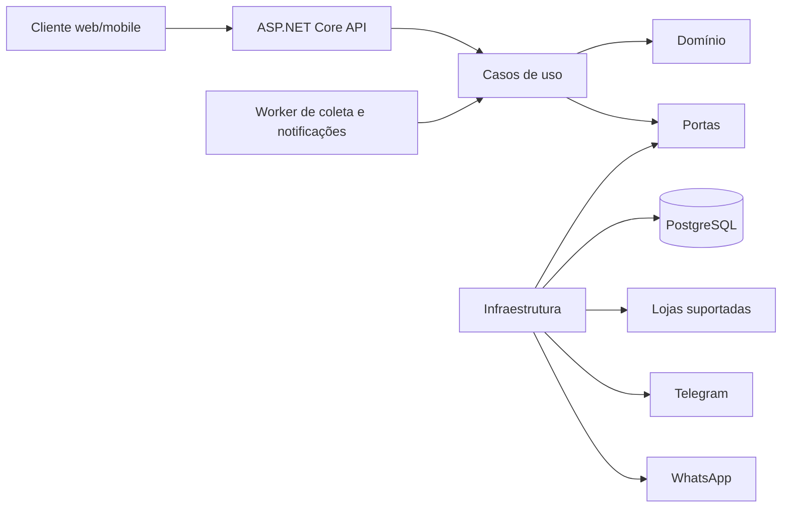
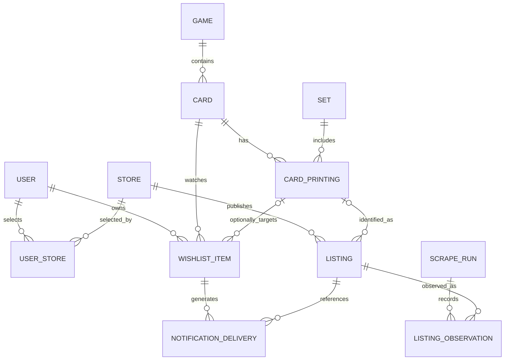
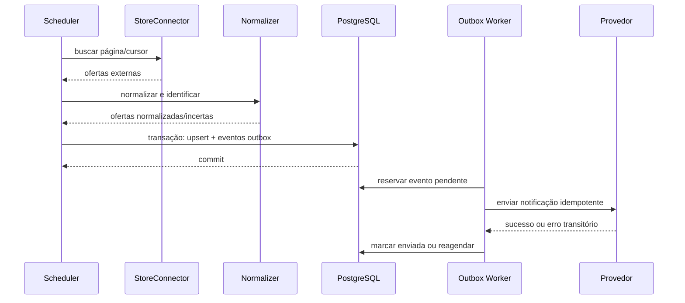

# TCGLooker

API para agregar ofertas de cartas Pokémon TCG em lojas suportadas, ajudando montadores de deck a encontrar as cartas desejadas e avisando quando itens da wishlist ficarem disponíveis.

O projeto está na fase de fundação arquitetural. A proposta inicial, o modelo de dados, os contratos da API e as decisões ainda abertas estão em [docs/architecture/base-architecture.md](docs/architecture/base-architecture.md).

## Princípios da primeira versão

- monólito modular, com API e processamento em segundo plano no mesmo repositório;
- PostgreSQL e autenticação hospedados no Supabase;
- Cards Hall e Tabletop TCG como primeiros conectores;
- cobertura de todas as coleções, idiomas, condições e acabamentos encontrados nas lojas;
- cadastro autenticado de sites compatíveis com conectores explicitamente suportados;
- separação entre carta, impressão/variante e oferta de uma loja;
- coleta idempotente e notificações com deduplicação;
- Telegram como primeiro canal recomendado; WhatsApp após validar opt-in e templates do provedor.

## Estado atual

A fundação usa .NET 10 e está separada em API, Worker, Application, Domain e Infra. Cada site habilitado no banco recebe um loop de coleta independente, o Worker persiste as ofertas no PostgreSQL e a API filtra sites privados pelo usuário autenticado.

## Configuração local

API e Worker compartilham o mesmo armazenamento local de User Secrets do .NET. Cadastre a conexão uma única vez na raiz do repositório:

```powershell
dotnet user-secrets set --project TCGLooker.API "ConnectionStrings:DefaultConnection" "SUA_CONNECTION_STRING"
dotnet user-secrets set --project TCGLooker.API "Supabase:Authority" "https://SEU_PROJECT_REF.supabase.co/auth/v1"
```

Para desenvolvimento local sem token ou configuração do Supabase Auth, ative o bypass nos User Secrets:

```powershell
dotnet user-secrets set --project TCGLooker.API "dev" "true"
dotnet run --project TCGLooker.API --launch-profile http
```

Nesse modo, a API usa o usuário local fixo `00000000-0000-0000-0000-000000000001` com permissão administrativa. O bypass somente funciona quando `ASPNETCORE_ENVIRONMENT=Development`; se `dev=true` chegar a outro ambiente, a aplicação recusa a inicialização. A conexão PostgreSQL continua obrigatória para rotas que acessam dados.

O segredo fica fora do repositório e não deve ser colocado em `appsettings.json` ou commitado. Para uma base nova, execute `database/bootstrap.sql`. Para uma base existente, aplique as migrations `002`, `003` e `004` em ordem.

Depois, inicie os dois processos em terminais separados sem definir variáveis:

```powershell
dotnet run --project TCGLooker.Worker
```

```powershell
dotnet run --project TCGLooker.API --launch-profile http
```

Teste a busca em `http://localhost:5204/api/v1/cards/search?q=Charizard`. Por padrão, o início consulta novidades; a reconciliação completa acontece após 24 horas de execução. Para popular todo o catálogo inicialmente, configure `Scraping:RunFullOnStartup=true` nessa execução e depois retorne a `false`. Os loops das lojas compartilham o limite de rede. Cada ciclo aguarda 15 minutos após terminar antes de começar outro.

### Limites e proxy do scraping

API (validação de sites) e Worker usam a mesma política, com um orçamento independente por processo:

| Configuração em `Scraping` | Padrão | Comportamento |
|---|---|---|
| `RequestsPerMinute` | 6 | Máximo por domínio, inclusive entre conectores distintos |
| `GlobalRequestsPerMinute` | 12 | Máximo somando todas as lojas no processo |
| `JitterMilliseconds` | 500 | Pausa aleatória adicional de 0 a 500 ms |
| `RequestTimeoutSeconds` | 30 | Tempo de rede por tentativa, incluindo leitura do corpo; exclui fila |
| `MaxRetries` | 2 | Até duas novas tentativas para falhas transitórias, com espera crescente |
| `ForbiddenRetryHours` | 24 | Pausa mínima após HTTP 403 |
| `RateLimitRetryMinutes` | 30 | Pausa mínima após HTTP 429 ou 503 com `Retry-After` |
| `UserAgent` | `TCGLooker/0.1` | Identificação do coletor; pode incluir contato do responsável |

As requisições são espaçadas, sem rajadas, com somente uma em andamento por processo. Listagens, produtos, tentativas e redirecionamentos consomem o mesmo orçamento. Redirecionamentos são limitados a três e permanecem no domínio original. Falhas de conexão também consomem o limite. Respostas são limitadas a 4 MiB, com validação de HTML de cadastro limitada a 2 MiB.

HTTP 403 e 429 encerram a coleta atual sem repetição imediata. `Retry-After`, tanto em segundos quanto em data HTTP, pode estender a pausa e também é respeitado em HTTP 503. A pausa por domínio fica gravada em `scraping-cooldowns.json` junto ao executável e sobrevive a reinícios; um estado existente ilegível impede requisições. Em containers, configure `Scraping:CooldownStatePath` em volume persistente gravável. Use um arquivo por processo: limites e estado não são coordenados entre API, Worker ou réplicas, e os contadores por minuto recomeçam ao reiniciar. Para compartilhar a mesma saída de rede, divida o orçamento entre processos e prefira uma única instância do Worker.

O proxy é fixo, opcional e desativado por padrão. Configure o endereço e as credenciais fora do repositório, por exemplo nos User Secrets compartilhados:

```powershell
dotnet user-secrets set --project TCGLooker.API "Scraping:Proxy:Enabled" "true"
dotnet user-secrets set --project TCGLooker.API "Scraping:Proxy:Url" "http://SEU_PROXY:8080"
dotnet user-secrets set --project TCGLooker.API "Scraping:Proxy:Username" "SEU_USUARIO"
dotnet user-secrets set --project TCGLooker.API "Scraping:Proxy:Password" "SUA_SENHA"
```

São aceitos proxies HTTP/HTTPS; usuário e senha são opcionais e separados da URL. Não há rotação de IP nem saída direta alternativa se o proxy falhar. Com o proxy desativado, o cliente não usa proxies implícitos do sistema. A validação HTTPS/domínio público continua ativa, inclusive antes de cada acesso via proxy; o proxy é uma infraestrutura de confiança e deve também bloquear destinos privados na sua própria resolução DNS e saída de rede.

As mesmas chaves estão exemplificadas em `.env.example`; o .NET não carrega esse arquivo automaticamente. Exporte as variáveis no ambiente ou use User Secrets. Os limites reduzem a carga, mas não garantem ausência de bloqueios. Confira a autorização e os limites de cada loja antes de habilitá-la; esta alteração não implementa leitura automática de `robots.txt`.

### Cadastro de sites

`POST /api/v1/stores` exige o access token emitido pelo Supabase Auth. O proprietário de um site com `scope: "user"` é sempre derivado do claim `sub`; a API não aceita `userId` no payload. Para `scope: "global"`, o JWT precisa conter `app_metadata.tcglooker_role = "admin"`.

Quando o bypass local `dev=true` estiver ativo, o token não é exigido e a identidade administrativa de desenvolvimento é usada automaticamente.

```json
{
  "name": "Minha Loja",
  "slug": "minha-loja",
  "baseUrl": "https://loja.example",
  "scope": "user",
  "connectorType": "liga_magic"
}
```

Antes de persistir, a API exige HTTPS público, bloqueia redes internas, credenciais e portas personalizadas, limita redirecionamentos e confirma que a página é compatível com o conector. Os workers repetem a proteção de rede e não seguem links de produtos para outro domínio.

### Wishlist

As rotas usam exclusivamente o claim `sub` do access token para identificar o proprietário:

- `POST /api/v1/me/wishlist` cria uma regra;
- `GET /api/v1/me/wishlist` lista apenas regras ativas;
- `GET /api/v1/me/wishlist?includeInactive=true` inclui o histórico desativado;
- `DELETE /api/v1/me/wishlist/{id}` desativa a regra sem apagar o histórico.

Exemplo de criação:

```json
{
  "cardId": "UUID_RETORNADO_PELA_BUSCA",
  "cardPrintingId": null,
  "maximumPrice": { "amount": 100.00, "currency": "BRL" },
  "minimumCondition": "near_mint"
}
```

Ofertas já existentes e novos upserts compatíveis geram `wishlist.matched` na outbox. O worker converte esses eventos em entregas para canais habilitados e verificados; adaptadores externos de Telegram/WhatsApp são conectados pela porta `INotificationSender` quando suas credenciais forem configuradas.

## Política de disponibilidade

- resultados da API incluem somente ofertas `in_stock`;
- estoque explicitamente zerado é marcado imediatamente como indisponível;
- ausência só marca uma oferta como indisponível após duas varreduras completas bem-sucedidas;
- falhas e varreduras incrementais nunca retiram ofertas;
- ofertas indisponíveis são removidas depois de 30 dias quando não há notificação pendente; cartas e impressões permanecem no catálogo.
- uma loja que responda `403 Forbidden` entra em espera por 24 horas; as demais lojas continuam sendo coletadas normalmente.

# ADR - Decisions

## Arquitetura-base do TCGLooker

## 1. Objetivo e limites

O TCGLooker agrega anúncios de cartas TCG publicados em lojas conhecidas, mantém os dados sem imagens e ajuda montadores de deck a localizar as cartas desejadas entre várias lojas. O sistema também notifica usuários quando uma carta da wishlist aparece.

### Requisitos confirmados

- API própria com persistência dos dados coletados.
- Coleta em mais de um site de venda de cartas.
- Busca agregada, inicialmente por nome da carta.
- Wishlist por usuário.
- Notificações por WhatsApp ou Telegram.
- Imagens das cartas não serão armazenadas.
- O MVP cobre somente Pokémon TCG.
- A coleta cobre todas as coleções, idiomas, condições e acabamentos encontrados nas lojas suportadas.
- As primeiras fontes são Cards Hall e Tabletop TCG.
- A coleta será executada a cada 15 minutos.
- Usuários escolhem fontes em um catálogo suportado no MVP; URLs arbitrárias são uma evolução futura.
- PostgreSQL e autenticação serão hospedados no Supabase; o schema operacional permanece privado.

### Hipóteses de trabalho

- Escala inicial: até 10 lojas, 100 mil ofertas ativas, 10 mil usuários e coletas a cada 15 minutos.
- Busca: p95 abaixo de 500 ms; atualização das ofertas em até 15 minutos; disponibilidade mensal alvo de 99,5%.
- Preços começam em BRL, mas o modelo aceita outras moedas.
- Dados sensíveis limitam-se a credenciais e identificadores de notificação (telefone, chat ID e tokens de provedores).
- Uma indisponibilidade temporária de loja pode atrasar dados sem indisponibilizar a busca.

Essas hipóteses servem para dimensionar a primeira versão e precisam ser confirmadas antes de produção.

### Fora do escopo inicial

- marketplace próprio, checkout ou intermediação de pagamento;
- armazenamento de imagens;
- scraping genérico de sites informados por URL;
- histórico analítico ilimitado de preços;
- microsserviços, Kubernetes, broker dedicado e cache distribuído.

## 2. Decisão arquitetural

Começar como **monólito modular**, com uma API HTTP e um Worker implantáveis separadamente quando necessário, compartilhando Application, Domain e Infrastructure. PostgreSQL é a única fonte de verdade. Não há justificativa de escala ou organização de times para microsserviços agora.



O código deve respeitar a direção `API/Worker -> Application -> Domain`. Infra implementa interfaces declaradas em Application; Domain não referencia ASP.NET, banco, Playwright, Supabase ou provedores de mensagem.

## 3. Stack proposta

| Componente | Escolha | Por quê | Alternativa preterida |
|---|---|---|---|
| Runtime | .NET 10 LTS / ASP.NET Core | A solução já é C#; .NET 10 tem suporte mais longo que o .NET 9 atual | Manter .NET 9: aproxima uma migração obrigatória e está em fase de manutenção |
| API | REST versionada (`/api/v1`) | Recursos e consumidores ainda simples; contratos fáceis de observar e cachear | GraphQL: complexidade sem consumidor que a justifique |
| Banco | PostgreSQL hospedado no Supabase | Transações, índices, JSONB para dados específicos de lojas e busca com `pg_trgm` | SQL Server: funciona, mas duplica suporte sem requisito; Elasticsearch: prematuro |
| Persistência | Npgsql + repositórios orientados a caso de uso | Superfície pequena, SQL explícito e sem SDK do provedor | Wrapper Dapper genérico: superfície grande e pouco ligada ao domínio; EF Core pode ser reavaliado se o CRUD crescer |
| Scraping | `HttpClient` + parser HTML por conector; Playwright apenas quando JavaScript for indispensável | HTTP direto é mais barato e previsível; browser é fallback | Playwright para tudo: maior consumo e mais pontos de falha |
| Agendamento | Worker .NET + jobs persistidos no PostgreSQL | Evita infraestrutura extra e mantém reprocessamento após reinício | Timer somente em memória: perde estado; RabbitMQ/Redis: prematuros |
| Notificação | Telegram primeiro; adaptador para WhatsApp Cloud API depois | Telegram reduz fricção no MVP; WhatsApp exige opt-in/template e validação operacional | SDKs chamados diretamente pelos casos de uso: cria acoplamento |
| Auth | Supabase Auth + validação JWT na API | Evita implementar identidade e mantém autorização de domínio na API | Auth próprio: trabalho e risco sem benefício demonstrado |

O Supabase hospeda PostgreSQL e Auth. A API valida access tokens pelo OIDC/JWKS, usa uma connection string do servidor e mantém suas tabelas no schema privado `tcglooker`, fora da Data API. Para um backend persistente, usar conexão direta quando IPv6 estiver disponível ou Supavisor em modo sessão quando o ambiente for apenas IPv4.

## 4. Módulos

```text
Catalog
  Games, Sets, Cards, CardPrintings
Marketplace
  Stores, StoreSelections, Listings, Search
Ingestion
  StoreConnectors, ScrapeRuns, Normalization, ListingUpsert
Watchlist
  WishlistItems, AvailabilityRules
Notifications
  Channels, Outbox, Deliveries
Identity
  Users and authorization boundary
```

Esses são limites lógicos, não serviços. O primeiro fluxo vertical deve atravessar todos os projetos para uma loja: coletar -> normalizar -> salvar -> buscar. Wishlist e notificações entram depois que a identidade das ofertas estiver estável.

## 5. Modelo de dados



### Entidades e atributos-chave

- `User`: `Id`, `ExternalAuthId`, `CreatedAt`, `Status`.
- `Store`: `Id`, `Slug`, `Name`, `BaseUrl`, `ConnectorKey`, `IsEnabled`.
- `UserStore`: `UserId`, `StoreId`, `IsEnabled`; seleção individual de fontes.
- `Game`: `Id`, `Slug`, `Name` (Pokémon, Magic etc.).
- `Set`: `Id`, `GameId`, `ExternalCode`, `Name`, `ReleasedOn`.
- `Card`: `Id`, `GameId`, `CanonicalName`, `NormalizedName`.
- `CardPrinting`: `Id`, `CardId`, `SetId`, `CollectorNumber`, `Language`, `Finish`, `Variant`.
- `Listing`: `Id`, `StoreId`, `ExternalId`, `CardPrintingId?`, `Title`, `NormalizedTitle`, `Condition`, `PriceAmount`, `Currency`, `Quantity?`, `Url`, `Fingerprint`, `FirstSeenAt`, `LastSeenAt`, `Availability`, `RawAttributesJson`.
- `ListingObservation`: amostra opcional de preço/estoque por execução; política de retenção curta no MVP.
- `ScrapeRun`: `Id`, `StoreId`, `StartedAt`, `FinishedAt`, `Status`, contadores e erro sanitizado.
- `WishlistItem`: `Id`, `UserId`, `CardId`, `CardPrintingId?`, `MaxPrice?`, `Condition?`, `IsActive`.
- `NotificationChannel`: `Id`, `UserId`, `Type`, `DestinationEncrypted`, `VerifiedAt`, `IsEnabled`.
- `NotificationDelivery`: `Id`, `WishlistItemId`, `ListingId`, `ChannelId`, `EventType`, `Status`, `Attempts`, `NextAttemptAt`, `SentAt`.
- `OutboxMessage`: evento durável criado na mesma transação que altera disponibilidade.

### Regras de consistência e idempotência

- Oferta é única por `(StoreId, ExternalId)`; se a loja não oferecer ID estável, usar `Fingerprint` documentado pelo conector.
- Dinheiro usa `numeric`, nunca ponto flutuante; moeda usa código ISO 4217.
- Cada página publica observações positivas de estoque e atualiza `LastSeenAt`. Estoque zerado e ausências só são promovidos após o término bem-sucedido da coleta; ausência exige duas reconciliações completas bem-sucedidas. Coleta parcial ou com falha nunca retira uma oferta.
- A busca retorna somente ofertas `in_stock`. Ofertas indisponíveis ficam retidas por 30 dias e só são removidas sem trabalho de notificação pendente; `Card` e `CardPrinting` permanecem no catálogo.
- Normalização incerta mantém `CardPrintingId = null`; nunca associa silenciosamente a variante errada.
- Entrega é única por `(WishlistItemId, ListingId, ChannelId, EventType, AvailabilityVersion)`, impedindo spam em retries.
- Alteração da oferta e criação do evento na outbox ocorrem na mesma transação. Envio ao Telegram/WhatsApp é eventualmente consistente.
- Histórico bruto deve ter retenção definida; a tabela operacional mantém somente o estado atual da oferta.

### Índices iniciais

- B-tree único em `listing(store_id, external_id)`.
- Índice parcial em `listing(card_printing_id, price_amount) where availability = 'in_stock'`.
- GIN/GiST com `pg_trgm` em `card.normalized_name` e, como fallback, `listing.normalized_title`.
- B-tree em `wishlist_item(user_id, is_active)`.
- Índice parcial em `outbox_message(next_attempt_at)` para mensagens pendentes.

## 6. Contrato dos conectores

Cada loja implementa um adaptador isolado:

```csharp
public interface IStoreConnector
{
    string Key { get; }
    Task<ScrapePage> FetchAsync(ScrapeRequest request, CancellationToken cancellationToken);
}
```

`ScrapePage` retorna registros externos ainda não persistidos e o próximo cursor. Normalização, upsert e notificações ficam fora do conector. Assim, mudar o HTML de uma loja não altera casos de uso nem o domínio.

Regras operacionais por conector:

- timeout, limite de concorrência e intervalo configuráveis;
- retry apenas para falhas transitórias, com backoff e jitter;
- circuit breaker por loja;
- User-Agent identificável e respeito aos termos, robots.txt e limites do site;
- fixtures HTML anonimizadas e testes de contrato para detectar quebra de seletor;
- Playwright isolado, com bloqueio de downloads e navegação fora dos hosts permitidos.

## 7. API inicial

Todos os endpoints autenticados derivam o usuário do token; nunca aceitam `userId` do cliente como autoridade.

| Método | Rota | Finalidade | Respostas relevantes |
|---|---|---|---|
| GET | `/health/live` | processo ativo | `200` |
| GET | `/health/ready` | dependências essenciais prontas | `200`, `503` |
| GET | `/api/v1/cards/search?q=charizard&page=1&pageSize=20` | busca agregada com ofertas em estoque | `200`, `400` |
| GET | `/api/v1/cards/{cardId}/listings` | ofertas ativas ordenadas | `200`, `404` |
| GET | `/api/v1/stores` | catálogo de fontes suportadas | `200` |
| PUT | `/api/v1/me/stores/{storeId}` | habilitar/desabilitar uma fonte | `204`, `404` |
| GET | `/api/v1/me/wishlist` | listar favoritos | `200`, `401` |
| POST | `/api/v1/me/wishlist` | criar regra de disponibilidade/preço | `201`, `400`, `409` |
| DELETE | `/api/v1/me/wishlist/{id}` | remover regra própria | `204`, `404` |
| POST | `/api/v1/me/notification-channels` | cadastrar destino | `202`, `400` |
| POST | `/api/v1/me/notification-channels/{id}/verify` | confirmar destino | `204`, `400`, `404` |

Formato de erro: RFC 9457 Problem Details, com `traceId`, sem stack trace ou conteúdo bruto coletado.

Exemplo de busca:

```json
{
  "items": [
    {
      "cardId": "uuid",
      "name": "Charizard",
      "printing": {
        "set": "Base Set",
        "collectorNumber": "4/102",
        "language": "pt-BR",
        "finish": "holo"
      },
      "offers": [
        {
          "store": "loja-a",
          "condition": "near_mint",
          "price": { "amount": 1250.00, "currency": "BRL" },
          "availability": "in_stock",
          "url": "https://loja.example/oferta/123",
          "observedAt": "2026-08-27T04:00:00Z"
        }
      ]
    }
  ],
  "page": 1,
  "pageSize": 20,
  "total": 1
}
```

## 8. Fluxos críticos

### Coleta e publicação



O scraper nunca envia notificações diretamente. Uma falha do provedor não reverte ofertas já coletadas, e um reinício não perde eventos confirmados no banco.

## 9. Segurança e operação

- Somente conectores compilados/configurados podem acessar a rede; o cadastro aceita URL apenas após validação HTTPS, SSRF e compatibilidade do conector.
- Tokens, connection strings e chaves ficam em secret manager/variáveis de ambiente, nunca em `appsettings.json` versionado.
- Destinos de notificação são cifrados em repouso e mascarados em logs.
- Autorização por propriedade em wishlist, fontes e canais; rate limiting nos endpoints públicos e autenticados.
- Logs estruturados com `traceId`, `storeId`, `scrapeRunId` e contadores, sem HTML bruto nem PII.
- Métricas mínimas: duração/sucesso da coleta por loja, ofertas novas/alteradas/incertas, idade da última coleta, profundidade da outbox, taxa/latência de notificações e busca p95.
- Alertas: fonte sem coleta bem-sucedida além do SLA, aumento súbito de itens não reconhecidos, outbox acumulada e falhas repetidas de autenticação do provedor.
- Health de prontidão verifica PostgreSQL; indisponibilidade de uma loja externa degrada somente aquela fonte.

## 10. Estrutura-alvo da solução

```text
TCGLooker.sln
src/
  TCGLooker.Api/             # HTTP, auth, versionamento, composition root
  TCGLooker.Worker/          # agendamento, coleta, outbox
  TCGLooker.Application/     # casos de uso, DTOs, portas
  TCGLooker.Domain/          # entidades, value objects, regras e eventos
  TCGLooker.Infra/           # PostgreSQL, conectores e notificadores
tests/
  TCGLooker.Domain.Tests/
  TCGLooker.Application.Tests/
  TCGLooker.IntegrationTests/
  TCGLooker.ConnectorTests/
docs/
  architecture/
```

Não é necessário mover os projetos imediatamente. Primeiro corrigimos SDKs/referências e construímos um fluxo vertical; a reorganização física pode ser feita sem misturá-la às regras de negócio.

## 11. Plano incremental

1. **Fundação:** confirmar perguntas abertas; migrar para .NET 10; corrigir projetos de classe e referências; configurar PostgreSQL, migrations, health checks e testes.
2. **Primeiro fluxo vertical:** uma loja simples por HTTP, catálogo mínimo, upsert idempotente e busca por nome.
3. **Robustez de coleta:** cursor, retries, circuit breaker, expiração de anúncios, métricas e fixtures de contrato.
4. **Identidade e preferências:** autenticação, seleção de lojas e wishlist.
5. **Notificações:** Telegram, verificação de canal, outbox/retries/deduplicação; depois validar WhatsApp.
6. **Escala orientada por métricas:** separar Worker, adicionar réplicas/cache ou broker somente quando medidas demonstrarem necessidade.

## 12. Riscos abertos

| Risco | Local no design | Severidade | Mitigação |
|---|---|---:|---|
| Termos de uso ou robots.txt proíbem coleta | Conectores | Alta | validar cada loja, preferir API/parceria e respeitar limites |
| HTML muda e produz dados silenciosamente errados | Conectores/normalização | Alta | testes com fixtures, métricas de anomalia e quarentena |
| Variantes são associadas à carta errada | Normalização | Alta | chaves por jogo/coleção/número; confiança e revisão de não reconhecidos |
| Sites bloqueiam automação | Coleta | Alta | baixa concorrência, cache/cursor e relacionamento com lojas; não tentar burlar proteção |
| WhatsApp rejeita mensagens ou exige template | Notificação | Média | consentimento explícito, templates aprovados; Telegram no MVP |
| Usuário recebe alertas repetidos | Outbox/delivery | Média | chave idempotente e estado/versionamento de disponibilidade |
| Crescimento do histórico | Observações | Média | retenção, agregação diária e particionamento apenas se necessário |
| URLs arbitrárias ampliam SSRF e manutenção | Evolução dos conectores | Alta | desenhar sandbox/allowlist e critérios de suporte antes de liberar cadastro |

## 13. Decisões confirmadas em 2026-08-27

1. O MVP cobre somente Pokémon TCG.
2. Cards Hall (`www.cardshall.com.br`) e Tabletop TCG (`www.tabletoptcg.com.br`) são as primeiras lojas.
3. O MVP cadastra sites apenas para tipos de conector suportados; `liga_magic` é o primeiro tipo disponível.
4. Quinze minutos é a frequência aceita para atualização.
5. Supabase hospeda PostgreSQL e autenticação; a API valida o JWT e aplica propriedade/escopo.

## Decisões-chave

- Monólito modular e PostgreSQL; sem microsserviços ou broker no MVP.
- Carta, impressão e oferta são entidades distintas.
- Conectores allowlisted; nada de URLs arbitrárias.
- Coleta idempotente e entrega assíncrona via outbox.
- Telegram precede WhatsApp no MVP.
- .NET 10 LTS é o alvo recomendado.
- O schema operacional é privado (`tcglooker`) e não é exposto pela Data API do Supabase.

## Artefatos gerados

- visão de componentes e módulos;
- modelo relacional inicial;
- catálogo de endpoints;
- contratos e regras de scraping;
- fluxo de coleta/notificação;
- plano incremental e matriz de riscos.

## Riscos ainda dependentes de validação

- autorização legal/técnica das lojas;
- estratégia de identificação de variantes por TCG;
- provedor de identidade;
- requisitos comerciais do canal WhatsApp.
